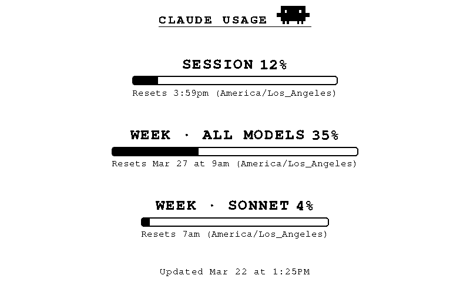

# Claude Usage → TRMNL

Display your [Claude Code](https://docs.anthropic.com/en/docs/claude-code) usage stats on a [TRMNL](https://usetrmnl.com) e-ink display.



Shows three metrics pulled directly from Claude Code's `/usage` command:

- **Session** — current session usage percentage and reset time
- **Week · All Models** — weekly usage across all models
- **Week · Sonnet** — weekly Sonnet-specific usage

## What This Runs on Your Mac

Claude Code doesn't have an API for usage data — the only way to get it is from the CLI itself. This project runs a small Python script on your Mac every 5 minutes that:

1. Opens Claude Code in the background, sends the `/usage` command, and reads the response
2. Sends the parsed metrics to your TRMNL webhook (an HTTPS POST with just the percentage numbers and reset times)
3. Closes Claude Code

That's it. No background daemons, no network listeners, no data sent anywhere except your own TRMNL webhook. The scheduling uses macOS `launchd` — the same system that runs built-in Mac services. You can inspect every line of code before installing, and uninstall with a single command (`./uninstall.sh`).

The script runs every 5 minutes so that reasonably fresh data is available when TRMNL refreshes the display (TRMNL's minimum refresh interval is 15 minutes).

## How It Works

1. **`claude_usage_scraper.py`** launches Claude Code in a pseudo-terminal, sends `/usage`, and parses the output using a terminal emulator ([pyte](https://github.com/selectel/pyte))
2. **`post_trmnl.py`** runs the scraper and POSTs the metrics to your TRMNL private plugin webhook
3. **`run.sh`** is the wrapper script called by macOS `launchd` every 5 minutes — it activates the venv, loads your `.env`, and runs the pipeline
4. **TRMNL** renders the data using the included HTML template on your e-ink display

## Prerequisites

- **macOS** (uses `launchd` for scheduling)
- **Python 3** (pre-installed on macOS)
- **[Claude Code](https://docs.anthropic.com/en/docs/claude-code)** installed and available in your `PATH`
- **[TRMNL](https://usetrmnl.com)** device with a Private Plugin configured

## Setup

### 1. Clone the repo

```bash
git clone https://github.com/carledwards/claude-usage-trmnl.git
cd claude-usage-trmnl
```

### 2. Configure your webhook URL

```bash
cp .env.example .env
```

Edit `.env` and paste your TRMNL Private Plugin webhook URL. You can find this in your TRMNL dashboard under **Plugins → Private Plugin**.

### 3. Create the TRMNL Private Plugin

1. In your [TRMNL dashboard](https://usetrmnl.com), go to **Plugins → Private Plugin**
2. Create a new plugin
3. Paste the contents of each markup file from `trmnl_plugin/` into the corresponding layout view:
   - `markup_full.html` → **Full**
   - `markup_half_vertical.html` → **Half Vertical**
   - `markup_half_horizontal.html` → **Half Horizontal**
   - `markup_quadrant.html` → **Quadrant**
4. Copy the webhook URL into your `.env` file (step 2 above)
5. Set the plugin's **refresh interval to 15 minutes** in the TRMNL dashboard

### 4. Setup dependencies

```bash
chmod +x setup.sh run.sh install.sh uninstall.sh
./setup.sh
```

This creates a Python virtual environment and installs the required packages. It will also verify your `.env` and that Claude Code is available.

### 5. Trust the folder in Claude Code

Claude Code requires you to accept a "Trust this folder" prompt the first time it runs in a directory. Do this once:

```bash
claude
# Accept the trust prompt, then type /exit
```

### 6. Test the pipeline

Before scheduling anything, verify the full pipeline works end-to-end:

```bash
./run.sh
```

You should see the scraper run, metrics parsed, and a successful POST to TRMNL. Check your TRMNL dashboard to confirm the data arrived. If something isn't right, this is the time to fix it.

### 7. Install the scheduled job

Once you've confirmed `./run.sh` works:

```bash
./install.sh
```

> **Note:** macOS may show a notification asking to allow "bash" to run in the background. You must allow this for the scheduled job to work. You can manage this later in **System Settings → General → Login Items & Extensions → Allow in the Background**.

The install script will:
- Create a Python virtual environment and install dependencies
- Generate a `launchd` plist with the correct paths
- Ask for your confirmation before installing the scheduled job
- Load the job (runs every 5 minutes)

## Usage

The scraper runs automatically every 5 minutes via `launchd`. The TRMNL display refreshes on its own schedule (recommended: every 15 minutes).

### Manual run

```bash
./run.sh
```

### View logs

```bash
tail -f /tmp/com.claude-usage-trmnl.agent.log    # stdout
tail -f /tmp/com.claude-usage-trmnl.agent.err    # stderr
```

### Trigger an immediate run

```bash
launchctl start com.claude-usage-trmnl.agent
```

### Uninstall the scheduled job

```bash
./uninstall.sh
```

## File Overview

| File | Purpose |
|---|---|
| `claude_usage_scraper.py` | Launches Claude Code, sends `/usage`, parses the terminal output |
| `post_trmnl.py` | Runs the scraper and POSTs results to the TRMNL webhook |
| `run.sh` | Wrapper script: loads `.env`, activates venv, runs the pipeline |
| `setup.sh` | Creates venv, installs dependencies, verifies configuration |
| `install.sh` | Generates and installs the launchd scheduled job |
| `uninstall.sh` | Removes the launchd scheduled job |
| `trmnl_plugin/` | TRMNL plugin assets: markup templates (full, half, quadrant), icon, and plugin.yml |
| `.env.example` | Template for your webhook URL |

## Troubleshooting

**Scraper returns "claude not found in PATH"**
Make sure Claude Code is installed and `which claude` returns a path. The install script automatically detects this and includes it in the launchd PATH.

**Scraper times out or returns empty metrics**
Run `claude` manually in the project directory to ensure the folder is trusted. You can also test with debug output:

```bash
source venv/bin/activate
python3 claude_usage_scraper.py --debug
```

**TRMNL shows stale data**
Check that the launchd job is loaded: `launchctl list | grep claude-usage`. Review `/tmp/com.claude-usage-trmnl.agent.err` for errors.

**403 from TRMNL webhook**
Verify your webhook URL in `.env` is correct and includes the full path with your plugin UUID.

## License

MIT
